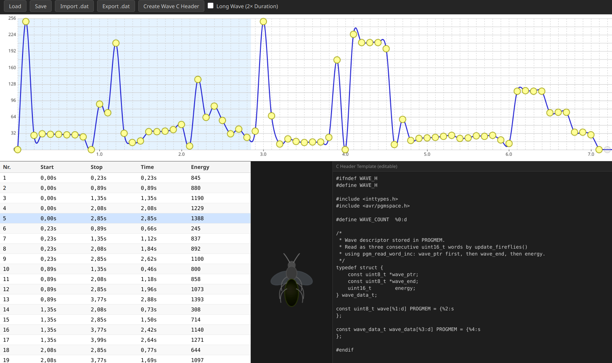

# WaveEditor

A browser-based waveform editor for designing LED animation curves for the Fireflies Project https://www.mikrocontroller.net/topic/99803. Draw and edit spline-based waveforms on an interactive canvas, compile them into data tables, preview playback on a virtual LED strip, and export the result as a C header file for embedded firmware. The Delphi software sources by the original autor H. Reddmann are lost so I created a Typescript app.



## Features

- Interactive spline editor with draggable control points
- Long Wave mode (2x duration) for extended animations
- Live LED playback preview
- Import/export binary `.dat` files
- Export as C header (`.h`) with configurable template
- JSON save/load for project persistence

## Prerequisites

- [Node.js](https://nodejs.org/) v18 or later
- npm (included with Node.js)

## Getting Started

Install dependencies:

```bash
npm install
```

Start the development server:

```bash
npm run dev
```

Open the URL shown in the terminal (usually `http://localhost:5173`).

## Build

Compile TypeScript and create a production bundle:

```bash
npm run build
```

Output is written to the `dist/` folder.

## Deploy

The `dist/` folder contains static files (HTML, JS, CSS) that run entirely in the browser. Deploy them to any static hosting provider:

- Copy the contents of `dist/` to your web server
- Or use GitHub Pages, Netlify, Vercel, S3, or similar services

No server-side runtime is required.
